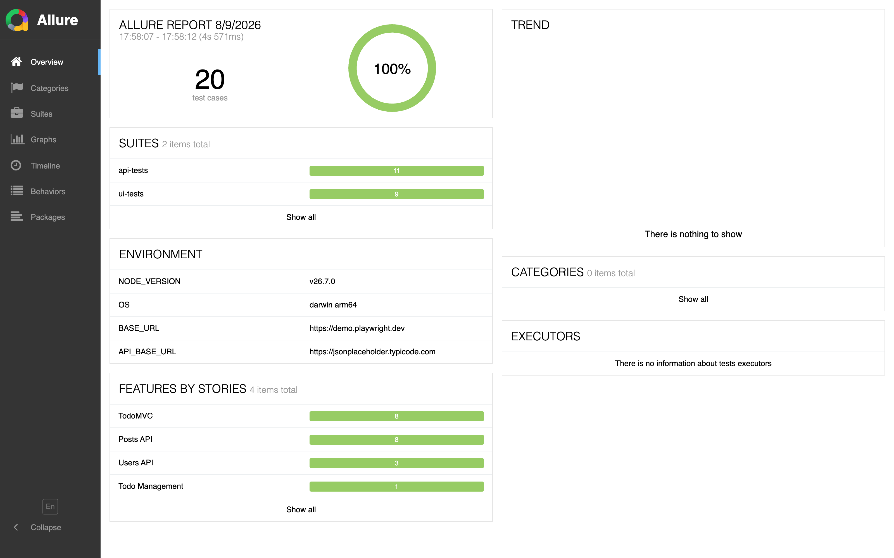

# Playwright E2E Framework

[](https://github.com/sp1r1n/playwright/actions/workflows/ci.yml)
[](https://sp1r1n.github.io/playwright/)
[](LICENSE)
[](https://playwright.dev/)
[](https://www.typescriptlang.org/)

UI and API test automation in TypeScript, reported through Allure and published to GitHub Pages
on every push to `main`.

**[Live Allure report →](https://sp1r1n.github.io/playwright/)**



The tests run against public demo targets — [TodoMVC](https://demo.playwright.dev/todomvc) for
UI and [JSONPlaceholder](https://jsonplaceholder.typicode.com/) for API — so the suite is
runnable by anyone, with nothing to provision.

## What is actually in here

The interesting part is not the tests; it is the machinery underneath them.

**Steps come from the page object, not the browser.** A `@step` decorator wraps every page
method in `test.step`, so the report reads `Add todo: Buy groceries` instead of a flat list of
`fill` and `press`. It is applied to the method, not repeated at each call site:

```ts
@step('Add todo: {0}')
async addTodo(text: string): Promise<void> {
  await this.newTodoInput.fill(text);
  await this.newTodoInput.press('Enter');
}
```

**Assertions become steps too.** `expectWithStep` proxies Playwright's `expect`, so each matcher
shows up as its own named step with the values it compared — the difference between a report
that says "test failed" and one that says which assertion failed and on what.

**API responses can be validated against a schema.** Zod schemas mirror each endpoint, and
passing `validate = true` turns a shape change into a clear failure instead of `undefined is not
a function` three lines later:

```ts
await api.posts.getPostById(1, true); // parsed against postSchema
```

Validation is opt-in per call. Contract checks belong in the tests that are about the contract.

**Every request is attached to the report.** A `@LogRequest` decorator on the API client records
method, URL, status, headers and body, so a failed API test carries its own evidence.

**Fixtures layer rather than repeat.** `base` (Allure metadata) → `api` (service client) →
`ui` (page objects, plus URL capture on failure). A UI test gets the API client for free, which
is how setup gets done over HTTP instead of by clicking.

## Quick start

```bash
git clone https://github.com/sp1r1n/playwright.git
cd playwright
npm ci
npm run install:browsers
npm test
```

Node 18+. Allure report generation additionally needs a JRE.

Configuration is optional — every default is a working public endpoint:

```bash
cp .env.example .env
```

| Variable          | Default                                | Purpose                                          |
| ----------------- | -------------------------------------- | ------------------------------------------------ |
| `BASE_URL`        | `https://demo.playwright.dev`          | Host for UI tests; page objects hold paths only  |
| `API_BASE_URL`    | `https://jsonplaceholder.typicode.com` | Host for API tests                               |
| `HEADLESS`        | `true`                                 | Set to `false` to watch the browser              |
| `BROWSER_CHANNEL` | bundled Chromium                       | `chrome` or `msedge` to use an installed browser |

## Structure

```
src/
├── api/
│   ├── core/
│   │   └── api-client.ts          # APIRequestContext + logging + Zod validation
│   └── jsonplaceholder/
│       ├── jsonplaceholder-api.ts # service aggregator
│       ├── models/                # Zod schemas; types inferred from them
│       └── services/              # posts, users
├── ui/
│   └── pages/
│       ├── base.page.ts           # navigation, screenshots, visibility helpers
│       ├── todo.page.ts           # TodoMVC page object
│       └── Pages.ts               # aggregator exposed to fixtures
└── utils/
    ├── decorators.ts              # @step, @LogRequest
    ├── expect-wrapper.ts          # expect() wrapped in test.step
    └── polling.ts                 # Polling builder, retry, wait

tests/
├── fixtures/                      # base → api → ui
├── api/                           # posts, users
└── ui/                            # todomvc
```

Cross-directory imports go through path aliases (`@src/*`, `@api/*`, `@ui/*`, `@utils/*`,
`@fixtures/*`); siblings stay relative.

## Running tests

```bash
npm test              # everything
npm run test:ui       # UI project only
npm run test:api      # API project only
npm run test:smoke    # anything tagged @smoke
npm run test:headed   # with a visible browser
npm run test:debug    # Playwright Inspector
```

Tags in use: `@smoke`, `@regression`, `@functional`, `@negative`.

```bash
npx playwright test --grep "@smoke|@negative"
npx playwright test tests/api/posts.spec.ts
```

### Reports

```bash
npm run allure:serve      # generate and open in one step
npm run allure:generate   # write allure-report/
npm run allure:open
```

Playwright's own HTML report opens automatically on failure locally.

## Writing a test

### UI

Add the page object, register it on `Pages`, and the fixture hands it to every test:

```ts
// src/ui/pages/login.page.ts
export class LoginPage extends BasePage {
  protected readonly pageUrl = '/login';
  protected readonly pageName = 'Login';

  readonly emailInput = this.page.getByLabel('Email');
  readonly submitButton = this.page.getByRole('button', { name: 'Sign in' });

  @step("Check that 'Login' page is opened")
  async isOpened(): Promise<void> {
    await expect(this.emailInput).toBeVisible();
  }

  @step('Sign in as {0}')
  async signIn(email: string, password: string): Promise<void> {
    await this.emailInput.fill(email);
    await this.page.getByLabel('Password').fill(password);
    await this.submitButton.click();
  }
}
```

```ts
// tests/ui/login.spec.ts
import { uiTest as test, expect } from '../fixtures';
import { allure } from 'allure-playwright';

test('signs in with valid credentials', { tag: '@smoke' }, async ({ pages }) => {
  await allure.feature('Auth');
  await allure.story('Sign in');
  await allure.severity('blocker');

  await pages.loginPage.goto();
  await pages.loginPage.signIn('user@example.com', 'correct-horse');

  expect(await pages.loginPage.getTitle()).toContain('Dashboard');
});
```

### API

A service method is one line plus its schema:

```ts
// src/api/jsonplaceholder/services/posts.service.ts
@step('Get post by ID: {0}')
async getPostById(id: number, validate = false): Promise<APIResponse> {
  return this.apiClient.get(`/posts/${id}`, postSchema, {}, validate);
}
```

```ts
// tests/api/posts.spec.ts
import { apiTest as test, expect } from '../fixtures';
import { Post } from '@src/api';

test('GET /posts/:id returns a single post', { tag: '@regression' }, async ({ api }) => {
  const response = await api.posts.getPostById(1, true);
  const post = (await response.json()) as Post;

  expect(response.status()).toBe(200);
  expect(post.id).toBe(1);
});
```

Soft assertions, for when several fields should all be reported rather than stopping at the
first mismatch:

```ts
await softExpectWithStep(user.email, 'Email should be present').toContain('@');
await softExpectWithStep(user.address, 'Address should be present').toHaveProperty('city');
```

## CI/CD

Every push and pull request runs three jobs:

1. **Types, lint, format** — `tsc --noEmit`, ESLint 9 flat config, Prettier check.
2. **Tests** — Chromium, retries on CI only, with traces, screenshots and videos uploaded as
   artifacts.
3. **Allure report** — generated even when tests fail, since that is when it is most useful,
   and on `main` deployed to GitHub Pages carrying history forward so the trend line survives.

To enable the deployment on a fork: **Settings → Pages → Build and deployment → GitHub Actions**.

## Scripts

| Script                                       | What it does                        |
| -------------------------------------------- | ----------------------------------- |
| `npm test`                                   | Run everything                      |
| `npm run test:ui` / `test:api`               | One project                         |
| `npm run test:smoke`                         | Tests tagged `@smoke`               |
| `npm run test:headed` / `test:debug`         | Visible browser / Inspector         |
| `npm run allure:serve` / `generate` / `open` | Allure report                       |
| `npm run typecheck`                          | `tsc --noEmit`                      |
| `npm run lint` / `lint:fix`                  | ESLint                              |
| `npm run format` / `format:check`            | Prettier                            |
| `npm run check`                              | Types, lint and formatting together |
| `npm run install:browsers`                   | Chromium with OS dependencies       |

## Contributing

See [CONTRIBUTING.md](CONTRIBUTING.md) for conventions — locator strategy, tagging, and where
new page objects go.

## License

[MIT](LICENSE)
